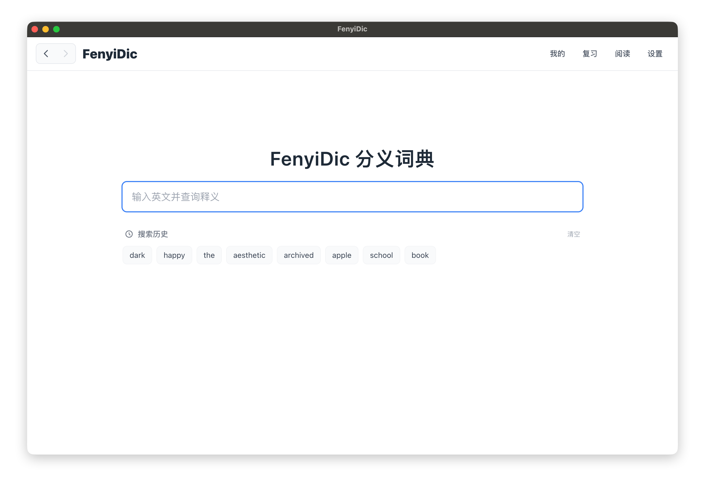
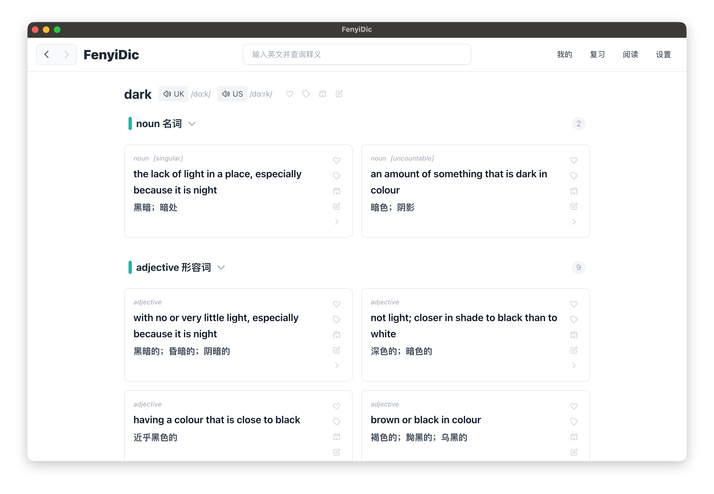
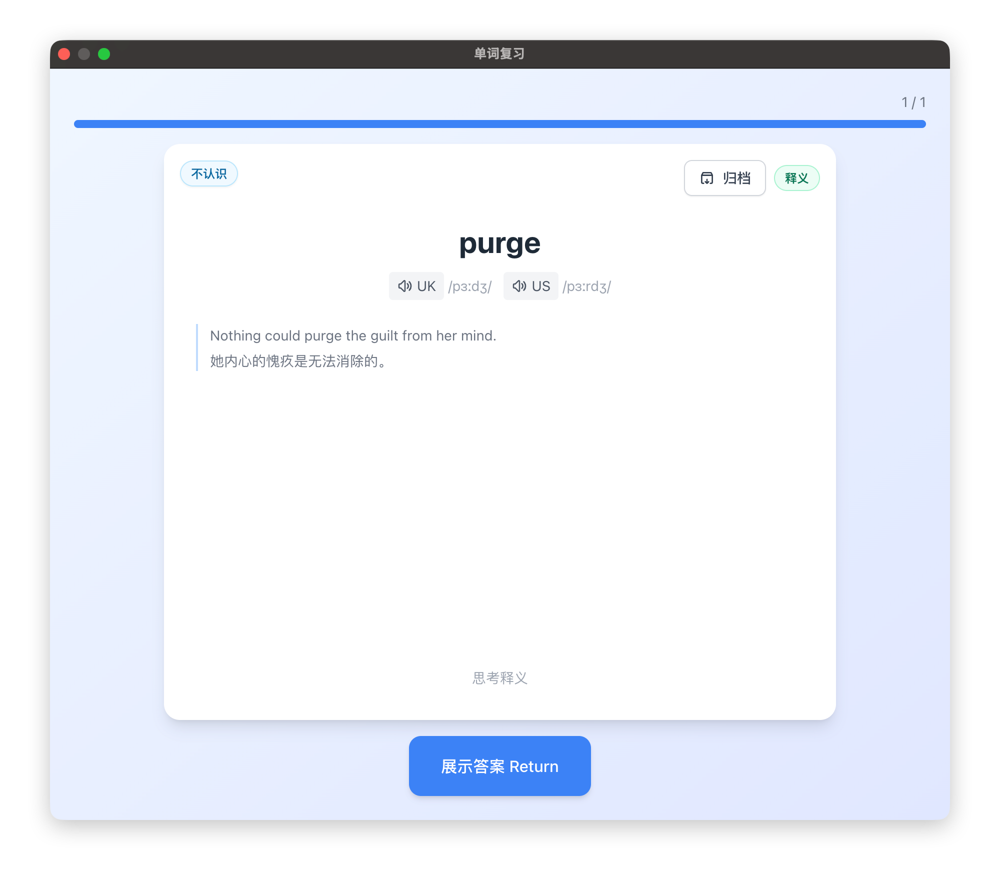

# FenyiDic

[简体中文](./README.md) | [English](./README_EN.md)

FenyiDic is a sense-based English dictionary desktop app that brings dictionary lookup, sense organization, guided intensive reading, and long-term review into one workflow.

Instead of saving only a word, FenyiDic helps you keep the exact sense you need to learn. Tags determine whether that item should later be reviewed through reading, listening, speaking, spelling, or dictation.

[Download the latest version](https://github.com/Bern3rsH/FenyiDic/releases/latest)



## Core Features

### Sense-Based Lookup

- View English definitions, Chinese definitions, and examples by entry
- Switch between English, Chinese, and bilingual definition modes
- Play UK and US pronunciations, with optional auto-play
- Save a specific sense or an entire word entry
- Add tags, notes, and archive status to words and senses



### Personal Library

- Manage words, senses, and other learning items separately
- Filter content by tag, favorite status, and archive status
- Apply favorites, archives, tags, tag removal, and note cleanup in batches
- Browse large personal libraries with pagination
- Import regular CSV files or complete data exported by FenyiDic
- Export general-purpose CSV data with Anki-friendly fields such as `front`, `back`, and `tags`


### Tag-Driven Review

FenyiDic uses FSRS to schedule reviews and lets you assign a review mode to each tag:

- Reading comprehension
- Listening comprehension
- Speaking check
- Spelling check
- Dictation check

For example, a listening-related tag can use Listening Comprehension, while a spelling-related tag can use Spelling Check. The same word or sense can enter different review tasks based on the learning issue you want to address.



### Guided Intensive Reading

- Paste an English article and work through a guided reading flow
- Mark unfamiliar words in the original text and look them up directly
- Select the exact dictionary sense that matches the context
- Collect vocabulary and grammar questions from the article
- Save items or add tags in batches so reading results enter long-term review


### Chinese And English Interfaces

The interface supports Simplified Chinese and English. Software update notes are also displayed in the selected interface language.

## Recommended Workflow

1. Import the dictionary files when launching the app for the first time.
2. Search for a word and identify the exact sense you need to learn.
3. Save the sense and add tags that describe the learning issue.
4. Assign a review mode to each tag in Settings.
5. Complete due tasks in the Review window.
6. Use Guided Intensive Reading to add new contextual learning items to your personal library.

## Download And Installation

Current releases are available for Apple Silicon Macs, Intel Macs, and Windows x64:

- macOS Apple Silicon: macOS 10.15 Catalina or later
- macOS Intel: macOS 10.15 Catalina or later
- Windows x64: Windows 10 or later. The Windows build has not been tested on a real Windows machine yet because no Windows device is currently available.

- [GitHub Releases](https://github.com/Bern3rsH/FenyiDic/releases/latest)

> **macOS installation notice:** After the first installation of FenyiDic and after installing each subsequent update, open System Settings > Privacy & Security, click Open Anyway, and then reopen FenyiDic.

If macOS says the app is damaged, cannot verify the developer, or only shows the Dock icon with no app window after a browser download, drag FenyiDic into Applications first, then run this command in Terminal:

```bash
sudo /usr/bin/xattr -dr com.apple.quarantine "/Applications/FenyiDic.app"
```

Then reopen FenyiDic.

## Dictionary Data

Neither this repository nor the application installer includes third-party dictionary data. MDX and MDD files are not distributed with the software.

The current import flow is designed for the specified Oxford bilingual dictionary files:

- MDX: required; contains entries and definitions
- MDD: optional; contains pronunciation audio and other resources

Users must obtain and use dictionary files legally. The application provides these download entry points:

- [Google Drive](https://drive.google.com/file/d/1R9DM3QP9mBaLhnQ2bCrCUp_UJdLgp90l/view?usp=sharing)
- [Baidu Netdisk](https://pan.baidu.com/s/1vVwRSmCW9QLrc5wipwitGw?pwd=nzuf)

## Local Development

```bash
npm install
npm run dev
```

Production build:

```bash
npm run build
npm run dist:mac
npm run dist:win
```

Build the database from a local MDX file:

```bash
MDX_PATH=/path/to/dictionary.mdx npm run db:build
```

## License

This project is source-available, not open-source software. The source code is provided only for inspection, personal non-commercial evaluation, and feedback.

Without prior written permission from the copyright holder, you may not use the project commercially, redistribute it, publish modified versions, distribute installers or binaries, provide hosted services, remove copyright or branding notices, or distribute third-party dictionary data, MDX/MDD files, dictionary content, or audio resources with the project.

See [LICENSE](./LICENSE) for the complete terms.
